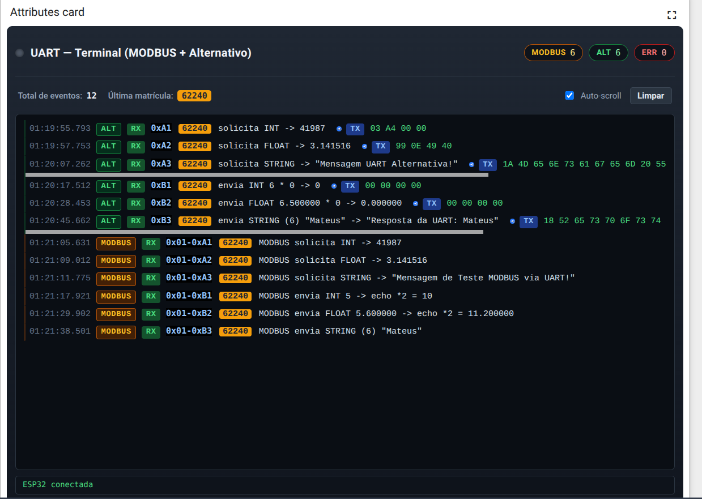

# Sistema de Controle de Semáforos e Protocolo UART — Entrega 2

Este projeto foi desenvolvido para a disciplina de Fundamentos de Sistemas Embarcados (2026/1). Ele implementa um sistema de controle de semáforos concorrente via GPIO e um sistema de comunicação UART (Protocolo Simplificado e MODBUS RTU) para interação entre a Raspberry Pi (sistema central) e a ESP32 (sistema distribuído).

## Requisitos e Dependências

- **Hardware**: Raspberry Pi (pinagem BCM) conectado à ESP32 via UART.
- **Linguagem**: Python 3.10+.
- **Bibliotecas Necessárias**: 
  - `pyserial` (para comunicação UART)
  - `RPi.GPIO` (para controle de hardware)

## Instalação (Build / Setup)

1. Clone o repositório para a sua Raspberry Pi.
2. Certifique-se de ter o Python 3 e o gerenciador de pacotes `pip` instalados.
3. Instale as dependências:

```bash
pip install -r requirements.txt
```

## Instruções de Execução

O projeto possui dois domínios principais que podem ser executados como módulos Python a partir da raiz do projeto:

### 1. Comunicação UART e MODBUS RTU (Menu CLI)

Para executar o menu de comunicação UART (que atende à **Entrega 2**) contendo a execução dos **12 comandos** (6 comandos do protocolo Simplificado e 6 comandos do MODBUS RTU modificado), utilize:

```bash
python3 -m src.uart_protocols.main
```

*(Nota: também pode ser invocado via `python3 -m src`, pois foi configurado como o _entry point_ padrão).*

### 2. Sistema de Semáforos (GPIO)

Para executar o sistema de controle de semáforos (referente à **Entrega 1**), utilize:

```bash
python3 -m src.traffic_system.main
```
Opções:
- Somente Modelo 1: `python3 -m src.traffic_system.main --modelo 1`
- Somente Modelo 2: `python3 -m src.traffic_system.main --modelo 2`

---

## Demonstração — Entrega 2

### 1. Print da Matrícula em Destaque (ThingsBoard Widget)
Abaixo está a representação do dashboard do ThingsBoard operando e recebendo os dados em tempo real com a matrícula em destaque:

> **Nota:** Substitua o link da imagem local ou remota do dashboard na linha abaixo.



### 2. Vídeo de Demonstração (Até 5 minutos)
Vídeo demonstrando a execução dos 12 comandos no terminal UART e o ThingsBoard recebendo os eventos em tempo real.

> **Nota:** Insira o link do seu vídeo na linha abaixo.

[🔗 Clique aqui para assistir ao vídeo de demonstração](https://link-para-o-seu-video.com)

---

## Estrutura do Projeto (Destaques)

```text
src/
├── __main__.py                      # Entry point padrão (aponta para o CLI UART)
├── common/
│   ├── config/settings.py           # Matrícula, Pinos GPIO, Portas UART e constantes
│   ├── exceptions/uart_exceptions.py# Exceções customizadas para erros UART/MODBUS
│   └── hal/uart_controller.py       # Camada de abstração de hardware para UART
├── traffic_system/                  # Controle de semáforos em threads (Entrega 1)
│   └── main.py                      
└── uart_protocols/                  # Lógica de comunicação UART (Entrega 2)
    ├── main.py                      # Menu CLI interativo
    └── protocols/
        ├── simple_protocol.py       # Implementação do protocolo simplificado
        ├── modbus_protocol.py       # Empacotamento/desempacotamento de frames MODBUS RTU
        └── crc_utils.py             # Lógica de validação e geração de CRC-16
```
